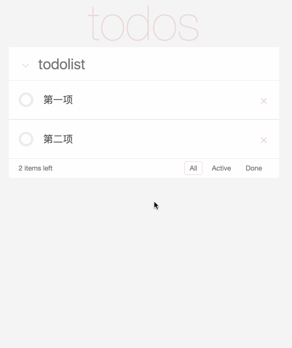

# todo-list

> You can checkout the react-redux branch to see the react + redux version

> This branch is react + router version

## Build step
``` bash

# install dependencies
yarn

# development
yarn dev

```

## Main technology

- react
- react-router

## Demo gif

